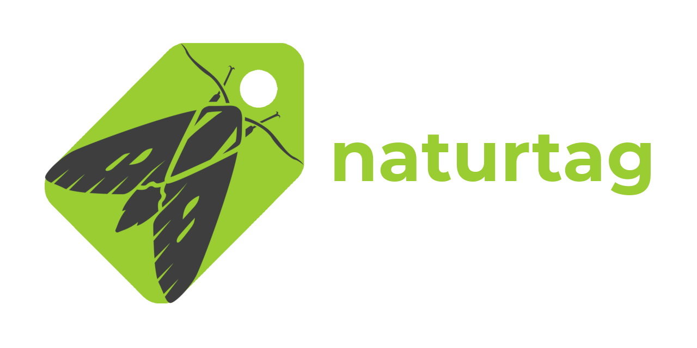

# Naturtag

[](https://github.com/JWCook/naturtag/actions)
[](https://naturtag.readthedocs.io)
[](https://github.com/JWCook/naturtag/issues)
[](https://pypi.org/project/naturtag)
[](https://pypi.org/project/naturtag)


<!-- RTD-IGNORE -->
<br />

[](https://naturtag.readthedocs.io)

## Contents
- [Summary](#summary)
- [Use Cases](#use-cases)
- [Installation](#installation)
- [Python Package](#python-package)
- [CLI](#cli)
- [GUI](#gui)
- [Development Status](#development-status)
<!-- END-RTD-IGNORE -->

## Summary
Naturtag is a tool for tagging image files with iNaturalist taxonomy & observation metadata.
This includes a basic **command-line interface**, a work-in-progress **desktop application**,
and can also be used as a **python package**.

## Use Cases
Naturtag takes useful information from your own iNaturalist observations and embeds it in your local
photo collection, mainly using [XMP](https://en.wikipedia.org/wiki/Extensible_Metadata_Platform) and
[EXIF](https://en.wikipedia.org/wiki/Exif) metadata. This has a variety of uses, including:

### Local photo organization
If you like the way you can search and filter your observations on iNaturalist.org and its mobile
apps, and you wish you could do that with your local photos, naturtag can help.
It can tag your photos with **hierarchical keywords**, which can then be used in a photo viewer or
DAM such as [**Lightroom**](https://millennialdiyer.com/articles/photography/lightroom-keyword-hierarchy/), [**FastPictureViewer**](https://www.fastpictureviewer.com), or
[**XnViewMP**](https://www.xnview.com/en/xnviewmp).

### Photo hosting
Naturtag can also simplify tagging photos for photo hosting sites like Flickr. For that use case, this
tool generates keywords in the same format as
[iNaturalist's Flickr Tagger](https://www.inaturalist.org/taxa/flickr_tagger).

### Other biodiversity tools
Finally, naturtag can improve interoperability with other tools and systems that interact with biodiversity
data. For example, in addition to iNaturalist you might submit some observations to another
platform with a more specific focus, such as **eBird**, **BugGuide**, or **Mushroom Observer**.
For that use case, this tool supports [Simple Darwin Core](https://dwc.tdwg.org/simple).

## Installation
* First, [install python 3.10](https://www.python.org/downloads/) if you don't have it yet.
* It's recommended to install into a [virtual environment](https://docs.python.org/3/library/venv.html).
* Then, install with pip:
```bash
pip install naturtag
```

## Python Package
See [naturtag documentation on readthedocs](https://naturtag.readthedocs.io) for details on the
python package, which lets you use most of naturtag's features in your own scripts or applications.

Basic examples:
```python
from naturtag import tag_images, refresh_tags

# Tag images with full observation metadata
tag_images(['img1.jpg', 'img2.jpg'], observation_id=1234)

# Tag images with taxonomy metadata only
tag_images(['img1.jpg', 'img2.jpg'], taxon_id=1234)

# Glob patterns are also supported
tag_images(['~/observations/*.jpg'], taxon_id=1234)

# Refresh previously tagged images with latest observation and taxonomy metadata
refresh_tags(['~/observations/'], recursive=True)
```

## CLI
This package provides the command `naturtag`, also aliased to `nt`. It takes an observation or
species, plus some image files, and generates EXIF and XMP metadata to write to those images.
You can see it in action here:
[](https://asciinema.org/a/0a6gzpt7AI9QpGoq0OGMDOxqi)

### CLI Options

See `naturtag --help` for full usage information. Options:
```yaml
Usage: naturtag [OPTIONS] [IMAGES]...

  Get taxonomy tags from an iNaturalist observation or taxon, and write them
  either to the console or to local image metadata.

Options:
  -c, --common-names      Include common names for all ranks that have them
  -f, --flickr-format     Output tags in a Flickr-compatible format
  -h, --hierarchical      Generate pipe-delimited hierarchical keywords
  -o, --observation TEXT  Observation ID or URL
  -t, --taxon TEXT        Taxon ID or URL
  -r, --recursive         Recursively scan subdirectories
  -x, --create-sidecar    Create XMP sidecar file if it doesn't already exist
  -v, --verbose           Show additional information
  --help                  Show this message and exit.
```

### Species & Observation IDs
Either a species or observation may be specified, either by ID or URL.
For example, all the following options will fetch the same taxonomy metadata:
```
naturtag -t 48978
naturtag -t https://www.inaturalist.org/taxa/48978-Dirona-picta
naturtag -o 45524803
naturtag -o https://www.inaturalist.org/observations/45524803
```

The difference is that specifying a species (`-t` / `--taxon`) will fetch only
taxonomy metadata, while specifying an observation (`-o` / `--observation`)
will fetch taxonomy plus observation metadata.

### Species Search
You may also search for species by name, for example `naturtag -t cardinal`.
If there are multiple results, you will be prompted to choose from the top 10 search results:


### Images
You can provide multiple paths or glob patterns, for example:
```
naturtag -t 48978 2022-01-01.jpg IMG*.jpg
```

Or you can provide a directory containing images. To also scan subdirectories, use
`-r` / `--recursive`:
```
naturtag -t 48978 -r ~/observations
```

### Keywords
Keywords will be generated in the format:
`taxonomy:{rank}={name}`

### Darwin Core
By default, Darwin Core metadata will be generated and included in XMP tags. This includes most
observation and taxonomy details.

### Sidecar Files
By default, XMP tags will be written to a sidecar file if it already exists.
Use `-x` `--create-sidecar` to create a new one if it doesn't exist.

### Hierarchical Keywords
Use `-h` / `--hierarchical` to generate hierarchical keywords. These will be interpreted as a tree
structure by image viewers that support them.

For example, the following keywords:
```bash
Animalia
Animalia|Arthropoda
Animalia|Arthropoda|Chelicerata
Animalia|Arthropoda|Hexapoda
```

Will translate into the following tree structure:
```
Animalia
    ┗━Arthropoda
        ┣━Chelicerata
        ┗━Hexapoda
```

### Examples
Just generate keywords from a taxon, without writing to a file:
```ini
$ naturtag -c -t 48978
Fetching taxon 48978
12 parent taxa found
22 keywords generated

taxonomy:kingdom=Animalia
taxonomy:phylum=Mollusca
taxonomy:class=Gastropoda
taxonomy:subclass=Heterobranchia
taxonomy:infraclass=Euthyneura
taxonomy:subterclass=Ringipleura
taxonomy:superorder=Nudipleura
taxonomy:order=Nudibranchia
taxonomy:suborder=Cladobranchia
taxonomy:superfamily=Proctonotoidea
taxonomy:family=Dironidae
taxonomy:genus=Dirona
"taxonomy:species=Dirona picta"
Animals
Molluscs
Gastropods
"Heterobranch Gastropods"
"Euthyneuran Gastropods"
"Nudipleuran Slugs"
Nudibranchs
"Colorful Dirona"
inaturalist:taxon_id=48978
```

Generate tags for an observation, and write to two images and one sidecar file:
```
$ naturtag -co 45524803 img00001.jpg img00002.jpg
Fetching observation 45524803
Fetching taxon 48978
12 parent taxa found
23 keywords generated
Getting darwincore terms for observation 45524803
Writing 39 tags to img00001.jpg
Writing 37 tags to img00001.xmp
Writing 39 tags to img00002.jpg
No existing XMP sidecar file found for img00002.jpg; skipping
```
[See example of XMP metadata generated by this command](assets/example_45524803.xmp).


## GUI
The main interface for this project will be a desktop application, although it's still a work in
progress. Soon this will be packaged into more convenient platform-specific builds, but for now it
must be installed and launched from the command line.

To launch, run:
```
python -m naturtag.app.app
```

### Image Selection and Tagging
The **Photos** tab is the main interface for selecting and tagging images:


1. Select images:
    * Drag & drop images or folders into the window
    * Or, select files via the file browser (from the toolbar, or `Ctrl+O`)
2. Select iNaturalist metadata:
    * Enter an iNaturalist observation ID or taxon ID
    * Or paste an iNaturalist URLs with `Ctrl+V`
    * Or search for a species from the **Species** tab (see details below)
    * Coming soon: search for observations from the **Observations** tab
3. Click the **Run** (▶️) button in the top right (or `Ctrl+R`) to tag the selected images

Mouse actions:
* **Left-click** an image to view fullscreen
* **Middle-click** an image to remove it
* **Right-click** an image for a context menu with more actions:


### Species Search
The **Species** tab contains tools to search and browse species to tag your images with:


#### Basic Search
You can start by searching by name, with autocompletion:


#### Full Search
Or you can also run a full search using additional filters:
* **Categories** filters by iconic taxa (Birds, Amphibians, etc.). `Ctrl-click` to select multiple.
* **Rank** filters by taxonomic rank (Family, Genus, Species, etc.).
  * Select an exact rank, for example to search only for species
  * Or select a minimum and/or maximum rank, for example to search for anything between a species
    and a family.
* **Parent** uses the selected taxon as a filter, and searches within children of that taxon. For
  example, to search for flies (_Diptera_) with 'ornate' in the name:


#### Navigation
* After selecting a taxon, you will see a list of its **Ancestors** and **Children**
* The **Back** and **Forward** buttons (or `Alt-Left`/`Right`) navigate through recently viewed taxa
* The **Parent** button (or `Alt-Up`) selects the immediate parent
* **View on iNaturalist** will show more details about the taxon on inaturalist.org, in a new browser tab
* Click on a taxon photo or the thumbnails to the right to view fullscreen

#### Species Lists
The additional tabs next to search results contain:
* **Recent:** Recently viewed taxa
* **Frequent:** Most frequently viewed taxa
* **Observed:** Taxa observed by you, sorted by observation count


### Settings
See the **Settings** menu for some settings to customize the metadata that your images will be
tagged with, iNaturalist info used in search filters, and other behavior:


### Keyboard Shortcuts
Some keyboard shortcuts are included for convenience:

Key(s)         | Action                    | Tab/Screen
----           |----                       |----------
`Ctrl+O`       | Open file browser         | Photos
`Ctrl+V`       | Paste photos or iNat URLs | Photos
`Ctrl+R`       | Run image tagger          | Photos
`Shift+Ctrl+X` | Clear selected images     | Photos
`F5`           | Refresh photo metadata    | Photos
`Ctrl+Enter`   | Run search                | Species
`Alt+Left`     | View previous taxon       | Species
`Alt+Right`    | View next taxon           | Species
`Alt+Up`       | View parent taxon         | Species
`Left`         | View previous image       | Fullscreen image (local photo or taxon)
`Right`        | View next image           | Fullscreen image (local photo or taxon)
`Escape`       | Exit fullscreen view      | Fullscreen image (local photo or taxon)
`Ctrl+Tab`     | Cycle through tabs        | All
`F11`          | Toggle fullscreen         | All
`Ctrl+Q`       | Quit                      | All

## Development Status
* See [Issues](https://github.com/JWCook/naturtag/issues?q=) for planned features and current progress.
* If you have any suggestions, questions, or requests, please
  [create an issue](https://github.com/JWCook/naturtag/issues/new/choose), or ping me (**@jcook**)
  on the [iNaturalist Community Forum](https://forum.inaturalist.org/c/general/14).
* When I'm not working on this, I'm usually working on other libraries that naturtag benefits from, including
  [requests-cache](https://requests-cache.readthedocs.io),
  [pyinaturalist](https://pyinaturalist.readthedocs.io), and
  [pyinaturalist-convert](https://github.com/JWCook/pyinaturalist-convert).
