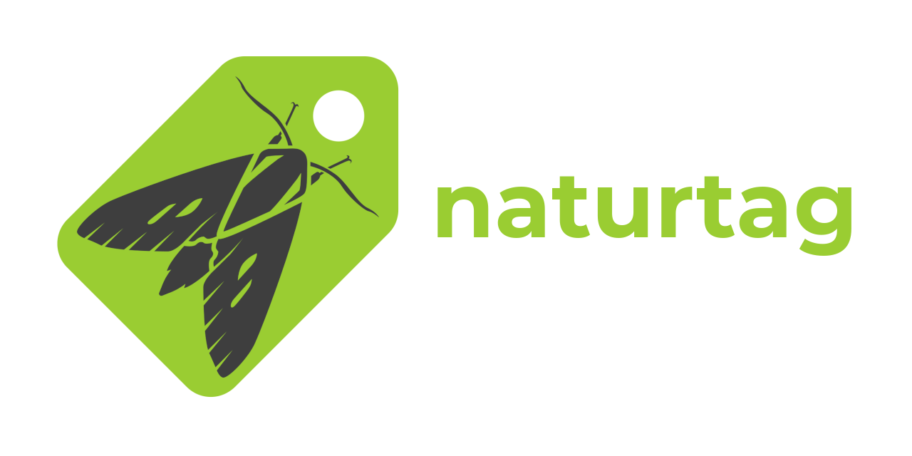
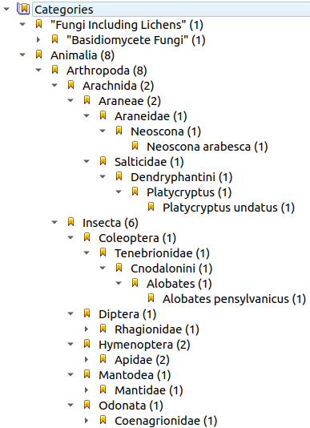
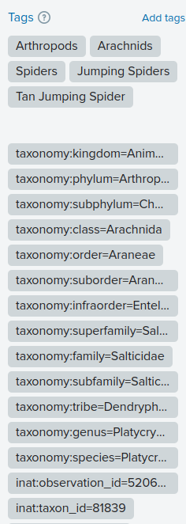

# Naturtag

[](https://github.com/JWCook/naturtag/actions)
[](https://naturtag.readthedocs.io/en/stable/)
[](https://github.com/JWCook/naturtag/issues)
[](https://pypi.org/project/naturtag)
[](https://pypi.org/project/naturtag)


<!-- RTD-IGNORE -->
<br />

[](https://naturtag.readthedocs.io)

## Contents
- [Summary](#summary)
- [Use Cases](#use-cases)
- [Installation](#installation)
- [Usage](#usage)
  - [GUI](#gui)
  - [CLI](#cli)
  - [Library](#library)
- [Development Status](#development-status)
<!-- END-RTD-IGNORE -->

## Summary
Naturtag is a tool for nature photographers that adds useful metadata to describe the organisms in
your photos. It includes a **desktop application**, a **command-line interface**, and can also be
used as a **python library**.

It is mainly intended for use with [iNaturalist](https://www.inaturalist.org); it can tag your
photos with either complete observation metadata, or just taxonomy metadata.


## Use Cases
Naturtag embeds this information in your local photo collection using
[XMP](https://en.wikipedia.org/wiki/Extensible_Metadata_Platform) and
[EXIF](https://en.wikipedia.org/wiki/Exif) metadata. This has a variety of uses, including:

### Local photo organization
Naturtag can tag your photos with **hierarchical keywords** (aka structured keywords), which
are supported by some photo viewers/editors like
[**Lightroom**](https://millennialdiyer.com/articles/photography/lightroom-keyword-hierarchy/),
[**FastPictureViewer**](https://www.fastpictureviewer.com),
[**Photo Mechanic**](https://www.photometadata.org/META-Tutorials-Photo-Mechanic-Applying-Keywords),
[**digiKam**](https://www.digikam.org), and
[**XnViewMP**](https://www.xnview.com/en/xnviewmp).

This basically gives you a taxonomic tree for browsing and filtering your photos.

<details>
<summary><b>Example in XnView</b></summary>


</details>

### Photo hosting
Naturtag can also simplify tagging photos for photo hosting sites like Flickr. For that use case, this
tool generates semi-structured keywords in the same format as
[iNaturalist's Flickr Tagger](https://www.inaturalist.org/taxa/flickr_tagger).

Example search using these tags: https://www.flickr.com/photos/tags/taxonomy:class=arachnida

<details>
<summary><b>Example of taxonomy tags on Flickr</b></summary>


</details>

### Other biodiversity tools
Finally, naturtag can improve interoperability with other tools and systems that interact with biodiversity
data. For example, in addition to iNaturalist you might submit some observations to another
platform with a more specific focus, such as **eBird**, **BugGuide**, or **Mushroom Observer**.
For that use case, this tool supports [Simple Darwin Core](https://dwc.tdwg.org/simple).

## Installation
See [GitHub Releases](https://github.com/pyinat/naturtag/releases) for downloads and
[Installation](https://naturtag.readthedocs.io/en/latest/installation.html)
for platform-specific instructions.

To just install naturtag as a python package, run:
```bash
pip install naturtag
```

## Usage

### GUI
The main interface for this project is still a work in progress.

It includes an interface for selecting and tagging images:


And tools to search and browse species to tag your images with:


See [Application Guide](https://naturtag.readthedocs.io/en/latest/app.html) for more details.

### CLI
Naturtag also includes a command-line interface. It takes an observation or species, plus some image
files, and generates EXIF and XMP metadata to write to those images. You can see it in action here:
[](https://asciinema.org/a/0a6gzpt7AI9QpGoq0OGMDOxqi)

See [CLI documentation](https://naturtag.readthedocs.io/en/latest/cli.html) for more details.

### Library
You can also import `naturtag` as a python library, and use its main features in your own scripts or
applications. Basic example:
```python
from naturtag import tag_images, refresh_tags

# Tag images with full observation metadata
tag_images(['img1.jpg', 'img2.jpg'], observation_id=1234)

# Refresh previously tagged images with latest observation and taxonomy metadata
refresh_tags(['~/observations/'], recursive=True)
```

See [API Reference](https://naturtag.readthedocs.io/en/latest/reference.html) for more details.


## Development Status
* See [Issues](https://github.com/JWCook/naturtag/issues?q=) for planned features and current progress.
* If you have any suggestions, questions, or requests, please
  [create an issue](https://github.com/JWCook/naturtag/issues/new/choose), or ping me (**@jcook**)
  on the [iNaturalist Community Forum](https://forum.inaturalist.org/c/general/14).
* When I'm not working on this, I'm usually working on other libraries that naturtag benefits from, including
  [requests-cache](https://requests-cache.readthedocs.io),
  [pyinaturalist](https://pyinaturalist.readthedocs.io), and
  [pyinaturalist-convert](https://github.com/JWCook/pyinaturalist-convert).
