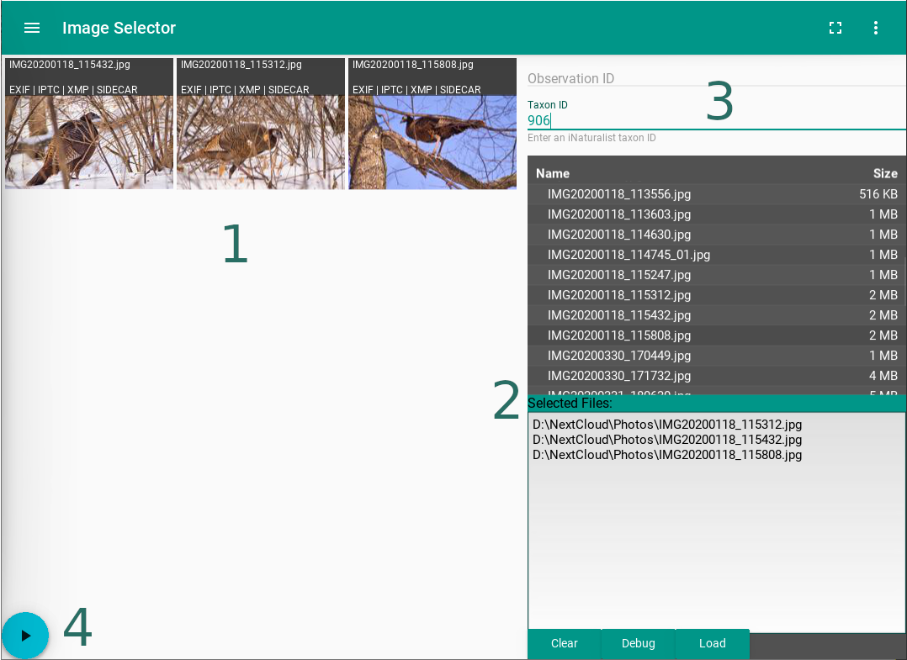
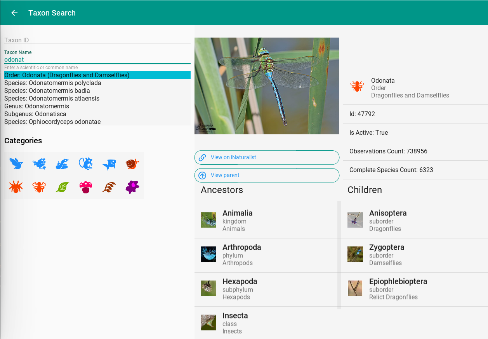
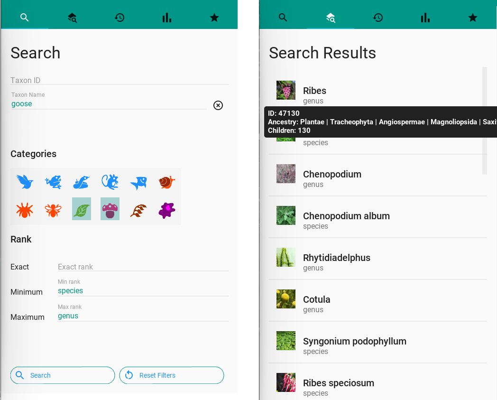
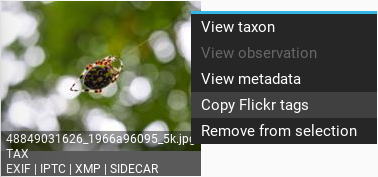
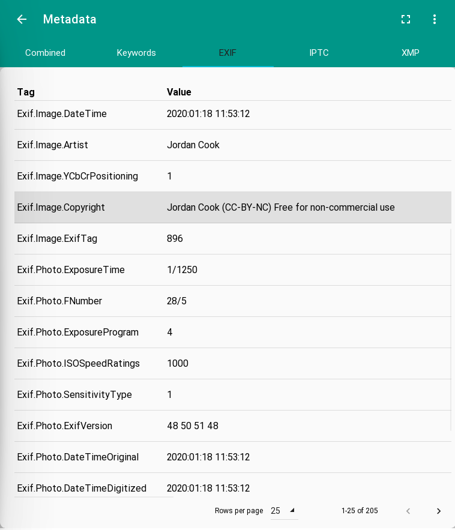
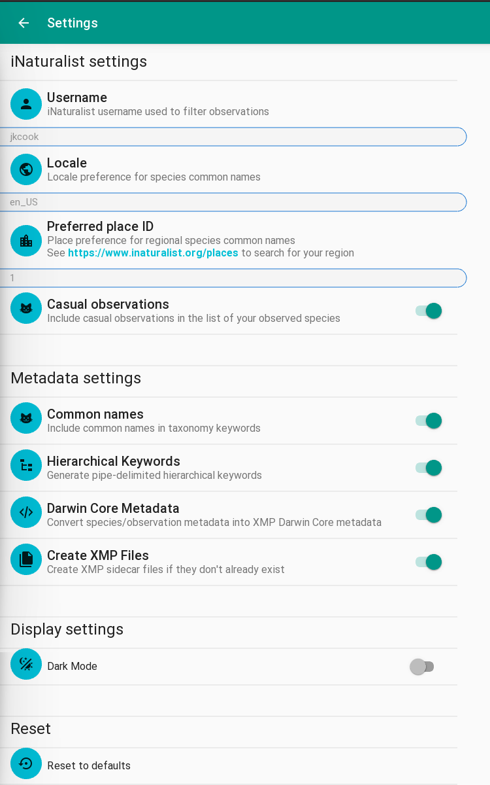

# Naturtag: an iNaturalist Image Tagger
[](https://travis-ci.org/JWCook/naturtag)
[](https://naturtag.readthedocs.io/en/latest/?badge=latest)


A tool to browse and add iNaturalist taxonomy & observation metadata to local observation photos.
This includes a command-line interface, a graphical interface, and can also be used as a
python package.

# Contents

* [Use Cases](#use-cases)
* [Development Status](#development-status)
* [Python Package](#python-package)
* [CLI](#cli)
    * [Installation](#cli-installation)
    * [Usage](#cli-usage)
    * [Data Sources](#data-sources)
    * [Images](#images)
    * [Keywords](#keywords)
    * [DarwinCore](#darwincore)
    * [Sidecar Files](#sidecar-files)
    * [Hierarchical Keywords](#hierarchical-keywords)
    * [Examples](#examples)
* [GUI](#gui)
    * [Installation](#gui-installation)
    * [Usage](#gui-usage)
    * [Image Selection and Tagging](#image-selection-and-tagging)
    * [Taxon Search](#taxon-search)
    * [Saved Species](#saved-species)
    * [Metadata](#metadata)
    * [Settings](#settings)
    * [Keyboard Shortcuts](#keyboard-shortcuts)
* [See Also](#see-also)

## Use Cases
The purpose of this is to take some of the useful information from your own observations and
embed it in your local photo collection.

### Metadata for other biodiversity tools
This can improve interoperability with other tools and systems that interact with biodiversity
data. For example, in addition to iNaturalist you may submit observations of certain species to
another biodiversity observation platform with a more specific focus, such as eBird, BugGuide, or
Mushroom Observer. For that use case, this tool supports
[Simple Darwin Core](https://dwc.tdwg.org/simple).

### Metadata for photo hosting
This can also simplify tagging photos for photo hosting sites like Flickr. For that use case, this
tool generates keywords in the same format as
[iNaturalist's Flickr Tagger](https://www.inaturalist.org/taxa/flickr_tagger).

### Metadata for local organization
Finally, this can enable you to search and filter your local photo collection by type of organism
like you can in the iNaturalist web UI or mobile apps. For that use case, a photo viewer or DAM
that supports **hierarchical keywords** is recommended, such as Lightroom,
[FastPictureViewer](https://www.fastpictureviewer.com), or
[XnViewMP](https://www.xnview.com/en/xnviewmp).

# Development Status
See [Issues](https://github.com/JWCook/naturtag/issues?q=) for planned features and
current progress.

This is currently just an experimental hobby project, and not very polished. All the
features described below are functional, however.

I plan to work on this long enough to prove whether or not the concept is useful as part
of a naturalist/photographer/hobbyist's workflow; if so, there is a long list of features
I'd like to continue adding onto this.

# Python Package
See [documentation on ReadTheDocs](https://naturtag.readthedocs.io) for details on the python package.


# CLI

## CLI Installation
This project depends on [exiv2](https://www.exiv2.org/download.html). Example install commands:
```bash
apt install exiv2   # Debian-based
dnf install exiv2   # Fedora-based
brew install exiv2  # MacOS
```

Then, install the python package:
```bash
pip install naturtag
```

Or, to install the latest development version:
```bash
pip install git+https://github.com/JWCook/naturtag.git
```

To run on python 3.7, you will also need the
[`importlib-metadata`](https://docs.python.org/3/library/importlib.metadata.html)
backport:
```bash
pip install importlib-metadata
```

## CLI Usage
This package provides the command `naturtag`, also aliased to `nt`.

```
Usage: naturtag [OPTIONS] [IMAGES]...

  Get taxonomy tags from an iNaturalist observation or taxon, and write them
  to local image metadata.

Options:
  -c, --common-names      Include common names for all ranks that have them
  -h, --hierarchical      Generate pipe-delimited hierarchical keywords
  -o, --observation TEXT  Observation ID or URL
  -t, --taxon TEXT        Taxon ID or URL
  -x, --create-xmp        Create XMP sidecar file if it doesn't already exist
  --help                  Show this message and exit.
```

### Data Sources
Either a taxon or observation may be specified, either by ID or URL.
For example, all of the following options will fetch the same taxonomy
metadata:
```
-t 48978
-t https://www.inaturalist.org/taxa/48978-Dirona-picta
-o 45524803
-o https://www.inaturalist.org/observations/45524803
```

The difference is that specifying a taxon (`-t`) will fetch only taxonomy
metadata, while specifying an observation (`-o`) will fetch taxonomy plus
observation metadata.

### Images
Multiple paths are supported, as well as glob patterns, for example:
`0001.jpg IMG*.jpg ~/observations/**.jpg`
If no images are specified, the generated keywords will be printed.

### Keywords
Keywords will be generated in the format:
`taxonomy:{rank}={name}`

### DarwinCore
If an observation is specified, DwC metadata will also be generated, in the
form of XMP tags. Among other things, this includes taxonomy tags in the
format:
`dwc:{rank}="{name}"`

### Sidecar Files
By default, XMP tags will be written to a sidecar file if it already exists.
Use the `-x` option to create a new one if it doesn't exist.

### Hierarchical Keywords
If specified (`-h`), hierarchical keywords will be generated. These will be
interpreted as a tree structure by image viewers that support them.

For example, the following keywords:
```
Animalia
Animalia|Arthropoda
Animalia|Arthropoda|Chelicerata
Animalia|Arthropoda|Hexapoda
```

Will translate into the following tree structure:
```
Animalia
    ┗━Arthropoda
        ┣━Chelicerata
        ┗━Hexapoda
```

### Examples

Just generate keywords from a taxon, without writing to a file:
```bash
naturtag -ct 48978
Fetching taxon 48978
12 parent taxa found
22 keywords generated

taxonomy:kingdom=Animalia
taxonomy:phylum=Mollusca
taxonomy:class=Gastropoda
taxonomy:subclass=Heterobranchia
taxonomy:infraclass=Euthyneura
taxonomy:subterclass=Ringipleura
taxonomy:superorder=Nudipleura
taxonomy:order=Nudibranchia
taxonomy:suborder=Cladobranchia
taxonomy:superfamily=Proctonotoidea
taxonomy:family=Dironidae
taxonomy:genus=Dirona
"taxonomy:species=Dirona picta"
Animals
Molluscs
Gastropods
"Heterobranch Gastropods"
"Euthyneuran Gastropods"
"Nudipleuran Slugs"
Nudibranchs
"Colorful Dirona"
inat:taxon_id=48978
```

Generate both keywords and DarwinCore metadata for an observation, and write to
two images and one XMP sidecar:
```
$ naturtag -co 45524803 img00001.jpg img00002.jpg
Fetching observation 45524803
Fetching taxon 48978
12 parent taxa found
23 keywords generated
Getting darwincore terms for observation 45524803
Writing 39 tags to img00001.jpg
Writing 37 tags to img00001.xmp
Writing 39 tags to img00002.jpg
No existing XMP sidecar file found for img00002.jpg; skipping
```
[See example of XMP metadata generated by this command](assets/example_45524803.xmp).

# GUI
This project also includes a graphical frontend, although it very early in development.

## GUI Installation
OS-specific builds will be coming soon, but for now running it requires a local python development
environment. To install:
```
pip install naturtag[ui]
```
Some additional dependencies are required on Windows:
```
pip install naturtag[ui-win]
```

##  GUI Usage

### Image Selection and Tagging
The basic UI components are shown below:


1. Drag & drop images or folders into the window.
2. Or, select files via the file browser on the right
3. Enter an iNaturalist observation ID or taxon ID
4. Click the 'Run' button in the lower-left to tag the selected images

Other things to do:
* **Middle-click** an image to remove it
* **Right-click** an image for a menu of more actions
* See [Metadata](#metadata) for more details

### Taxon Search
If you don't already know the taxon ID, click the 'Find a Species' button to go to the taxon
search screen. You can start with searching by name, with autocompletion support:



You can also run a full search using the additional filters. For example, to search for plants
and fungi with 'goose' in either the species or genus name:



### Saved Species
The additional tabs on the taxon screen contain:
* History of recently viewed taxa
* Most frequently viewed taxa
* Starred taxa

To save a particular taxon for future reference, click the ✩ icon in the top left of its info panel,
and it will be saved in the ★ tab. These items can be re-ordered via **Right-click** -> **Move to top**.
(Unfortunately, drag-and-drop functionality is not currently possible for list items).

### Metadata
**Right-click** an image and select **Copy Flickr tags** to copy keyword tags compatible with Flickr.


Also, a very simple (and ugly) metadata view is included, mainly for debugging purposes.
To open it, **Right-click** an image and select **View metadata**.



### Settings
There are also some settings to customize the metadata that your images will be tagged with,
as well as iNaturalist info used in search filters. And yes, there is a dark mode, because
why not.



See [CLI Usage](#cli-usage) for more details on these settings.

### Keyboard Shortcuts
Some keyboard shortcuts are included for convenience:

Key(s)          | Action                    | Screen
----            |----                       |----------
F11             | Toggle fullscreen         | All
Ctrl+O          | Open file chooser         | Image selection
Shift+Ctrl+O    | Open file chooser (dirs)  | Image selection
Ctrl+Enter      | Run image tagger          | Image selection
Ctrl+Enter      | Run taxon search          | Taxon search
Shift+Ctrl+X    | Clear selected images     | Image selection
Shift+Ctrl+X    | Clear search filters      | Taxon search
Ctrl+S          | Open settings screen      | All
Ctrl+Backspace  | Return to main screen     | All
Ctrl+Q          | Quit                      | All

# See Also
* For generating keyword _collections_, see the related tool
  [`taxon-keyword-gen`](https://github.com/JWCook/taxon-keyword-gen).
* This project uses [`pyinaturalist`](https://github.com/niconoe/pyinaturalist), a python API
  client for iNaturalist. Refer to that project for more data access tools.
