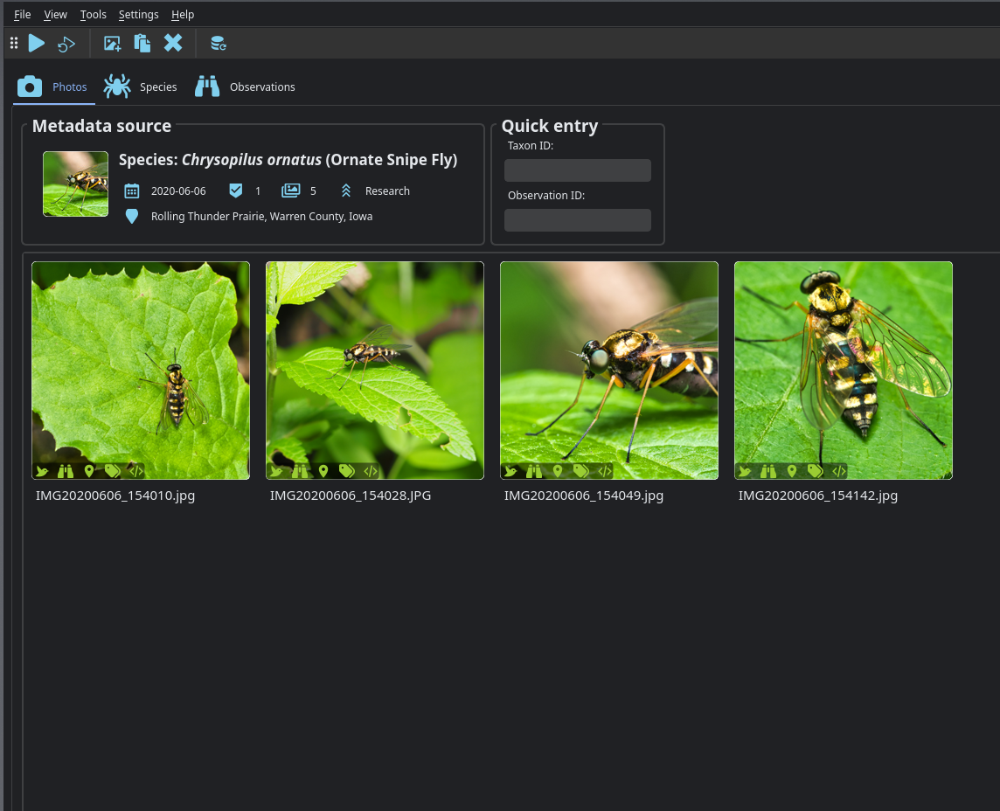
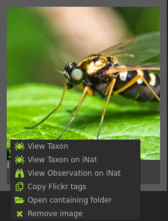
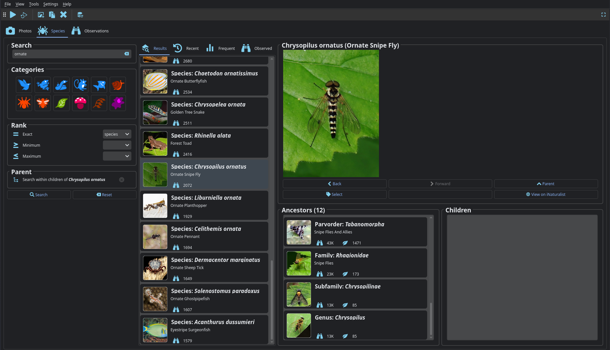
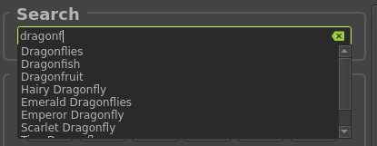
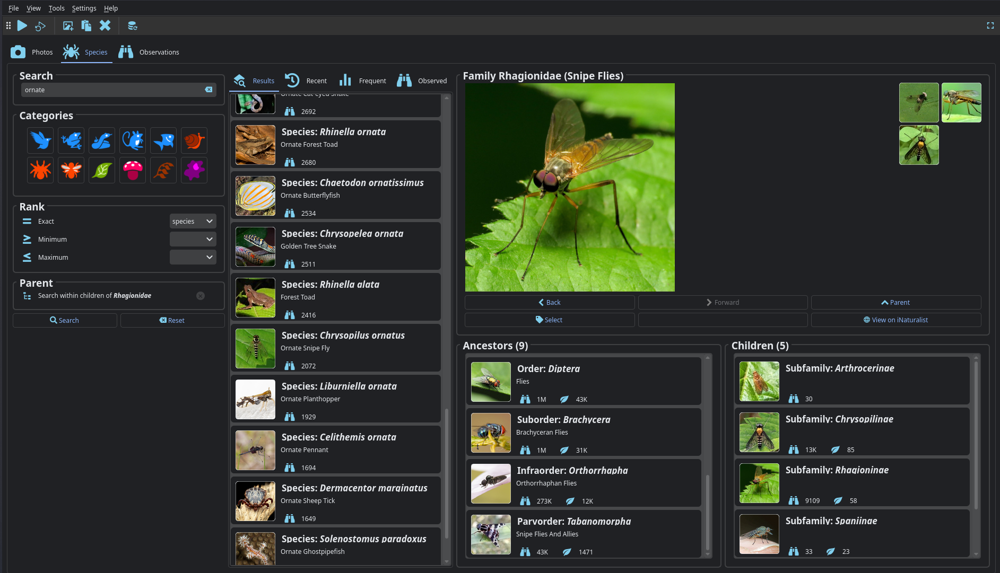
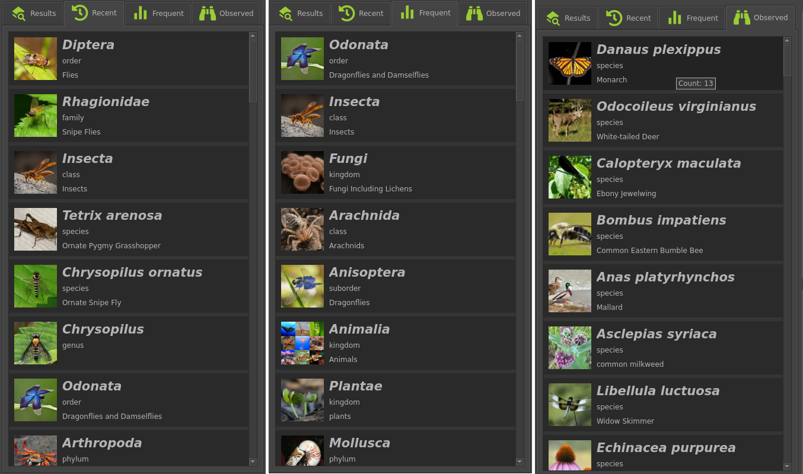
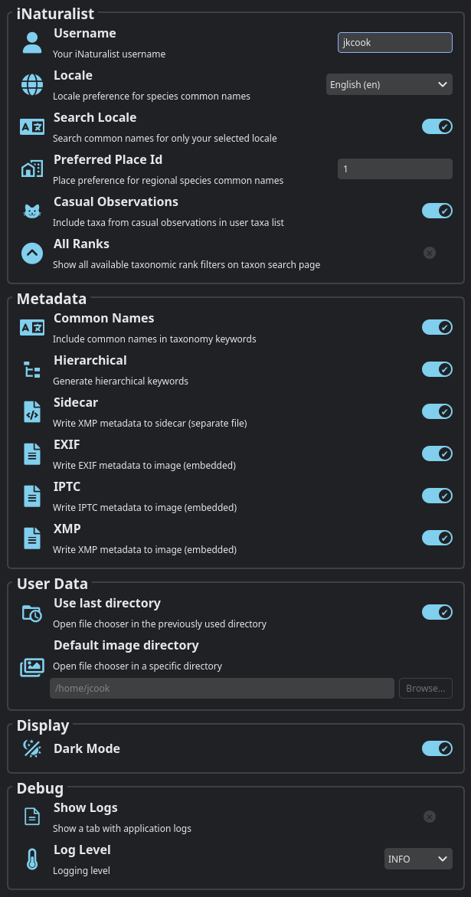

# {fa}`book` Application Guide
This page describes how to use the main features of the Naturtag desktop application.

Typically there will be three steps:
1. {ref}`Select photos <selecting-images>`
2. {ref}`Select an observation or species <selecting-metadata-source>`
3. {ref}`Tag images <tagging-images>`

```{note}
Currently, the UI is meant for tagging one set of related photos at a time, but batch tagging
features are planned for future updates.
```

(selecting-images)=
## Selecting Images
The **Photos** tab is the main interface for selecting and tagging images:



To select images:
* Drag & drop images or folders into the window
* Select files with the {material-outlined}`add_photo_alternate` **Open** button in the toolbar (or `Ctrl+O`)

Mouse actions:
* **Left-click** an image for a fullscreen view
* **Middle-click** an image to remove it
* **Right-click** an image for a context menu with more actions:

Use the {fa}`remove` button  in the toolbar (or `Ctrl+Shift+X`) to clear all selected images.



(selecting-metadata-source)=
## Selecting a Metadata Source
Next, you will specify an observation or species to use as a metadata source
There are a few ways to do this:
* Paste an iNaturalist URL anywhere (with `Ctrl+V` or the {fas}`paste` **Paste** button from the toolbar)
* Enter an iNaturalist observation ID or taxon ID
* Use the {ref}`species-search` page

(tagging-images)=
## Tagging Images
Once you have selected images and a metadata source, click the {fa}`play` **Run** button in the toolbar
(or `Ctrl+R`) to generate and save image metadata.

## Refreshing Metadata
In many cases, you might upload an observation with only a rough identification (order, family,
etc.), and later get a more specific (or corrected) ID on iNaturalist. In these cases, you can use
the {fa}`refresh` **Refresh** button in the toolbar (or `F5`) to quickly update all of your selected images
that have been previously tagged. When using Refresh, you can select images for multiple
observations and taxa.

Refresh has the following behavior depending on the metadata source:
* For observations, this will update your image metadata with the latest observation details from
iNaturalist, and fill in any additional missing information.
* For taxa, this will update your image metadata with any missing taxonomy information (for example
  if an image has been tagged with only a taxon ID)

:::{note}
If you would like to use a different tool to add taxon IDs to your photos, and then use Naturtag to
fill in the rest of the details, you can add it as an EXIF or XMP keyword in the format:
```
taxon_id:12345
```
:::

(species-search)=
## Species Search
The **Species** tab contains tools to search and browse species to tag your images with:



This can be used to search for any taxonomic rank (genus, family, etc.), not just species.
Elsewhere in the docs these will be referred to as **taxa** (singular: **taxon**).

### Basic Search
You can start by searching by name, with autocompletion:



### Full Search
Or you can also run a full search using additional filters:
* **Categories** filters by iconic taxa (Birds, Amphibians, etc.). `Ctrl-click` to select multiple.
* **Rank** filters by taxonomic rank (Family, Genus, Species, etc.).
    * Select an exact rank, for example to search only for species
    * Or select a minimum and/or maximum rank, for example to search for anything between a species
        and a family.
* **Parent** uses the selected taxon as a filter, and searches within children of that taxon.

For example, a search for flies (_Diptera_) with 'ornate' in the name will look like this:



### Navigation
* After selecting a taxon, you will see a list of its **Ancestors** and **Children**
* The **Back** and **Forward** buttons (or `Alt-Left`/`Right`) navigate through recently viewed taxa
* The **Parent** button (or `Alt-Up`) selects the immediate parent
* **View on iNaturalist** will show more details about the taxon on inaturalist.org
* Click on a taxon photo (or the thumbnails to the right) for a fullscreen view

### Taxon Lists
The additional tabs next to search results contain:
* **Recent:** Recently viewed taxa
* **Frequent:** Most frequently viewed taxa
* **Observed:** Taxa observed by you, sorted by observation count



(app-settings)=
### Settings
See the **Settings** menu for some settings to customize the metadata that your images will be
tagged with, iNaturalist info used in search filters, and other behavior:



```{note}
The settings in the **Metadata** section also apply to the {ref}`cli`.
```

### Image Directories
Under the **File** menu, there are submenus with shortcuts to commonly used image directories:
* **Open Recent** Will show the most recently used directories
* **Open Favorites** Will show the directories you have marked as favorites

#### Adding and removing favorites
To add a directory to favorites select **Add a favorite** from the favorites submenu. You can also Ctrl-click a directory from the recent submenu.

To remove a directory from favorites, Ctrl-click the directory from the favorites submenu.

## Keyboard Shortcuts
Some keyboard shortcuts are included for convenience:

Key(s)         | Action                      | Tab/Screen
------         | ------                      | ----------
`Ctrl+O`       | Open file browser           | Photos
`Ctrl+V`       | Paste photos or iNat URLs   | Photos
`Ctrl+R`       | Run image tagger            | Photos
`Ctrl+Shift+X` | Clear selected images       | Photos
`F5`           | Refresh photo metadata      | Photos
⠀              |                             |
`Ctrl+Enter`   | Run search                  | Species
`Alt+Left`     | View previous taxon         | Species
`Alt+Right`    | View next taxon             | Species
`Alt+Up`       | View parent taxon           | Species
⠀              |                             |
`Left`         | View previous image         | Fullscreen image (local photo or taxon)
`Right`        | View next image             | Fullscreen image (local photo or taxon)
`Escape`       | Exit fullscreen view        | Fullscreen image (local photo or taxon)
`Del`          | Remove image from selection | Fullscreen image (local photo)
⠀              |                             |
`Ctrl+Tab`     | Cycle through tabs          | All
`Ctrl+Shift+F` | Add a directory to favorites| All
`Ctrl+Shift+T` | Toggle toolbar visibility   | All
`F11`          | Toggle fullscreen           | All
`Ctrl+Q`       | Quit                        | All
