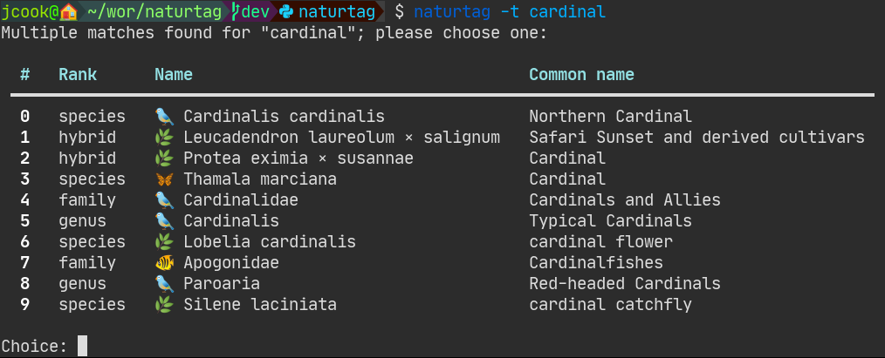

(cli)=
# {fa}`terminal` CLI
This page describes how to use the Naturtag CLI.

The basic tagging features of naturtag can be used via the command `naturtag`, also aliased to `nt`.
It takes an observation or species, plus some image files, and generates EXIF and XMP metadata to
write to those images. You can see it in action here:
[](https://asciinema.org/a/0a6gzpt7AI9QpGoq0OGMDOxqi)

```{note}
See `nt <command> --help` for full usage information of any command.
```

## Install
The `install` command sets up optional shell completion and other features.

Shell tab-completion is available for bash and fish shells. To install, run:
```bash
nt install -s [shell name]
```

This will provide tab-completion for CLI options as well as taxon names, for example:
```bash
nt tag -t corm<TAB>
```

Options:
```bash
-a, --all                Install all features
-d, --db                 Initialize taxonomy database
-s, --shell [bash|fish]  Install shell completion scripts
-f, --force              Reset database if it already exists
```

## Tag
The `tag` command gets taxonomy tags from an iNaturalist observation or taxon,
and writes them either to the console or to local image metadata.

Options:
```bash
-f, --flickr            Output tags in a Flickr-compatible format
-p, --print             Print existing tags for previously tagged images
-o, --observation TEXT  Observation ID or URL
-t, --taxon TAXON       Taxon name, ID, or URL
```

### Image Paths
You can provide multiple paths, directories or glob patterns, for example:
```
nt tag -t 48978 2022-01-01.jpg IMG*.jpg
```

Or you can provide a directory containing images. To also scan subdirectories, use
`-r` / `--recursive`:
```
nt tag -t 48978 -r ~/observations
```

### Species & Observation IDs
Either a species or observation may be specified, either by ID or URL.
For example, all the following options will fetch the same taxonomy metadata:
```bash
nt tag -t 48978
nt tag -t https://www.inaturalist.org/taxa/48978-Dirona-picta
nt tag -o 45524803
nt tag -o https://www.inaturalist.org/observations/45524803
```

The difference is that specifying a species (`-t` / `--taxon`) will fetch only
taxonomy metadata, while specifying an observation (`-o` / `--observation`)
will fetch taxonomy plus observation metadata.

### Species Search
You may also search for species by name, for example `nt -t cardinal`.
If there are multiple results, you will be prompted to choose from the top 10 search results:


### Metadata Options
Some additional options are available to change which metadata formats to use.
The CLI will use the same {ref}`app-settings` as the app, if available.

You can also directly edit the config file at `settings.yml` in the naturtag data directory. The
location varies by platform, and you can get this info from `nt --version`.

See {ref}`metadata` for more details on the metadata than naturtag generates.


### Tag examples
Just generate keywords from a taxon, without writing to a file:
```ini
$ nt tag -p -t 48978
Fetching taxon 48978
12 parent taxa found
22 keywords generated

taxonomy:kingdom=Animalia
taxonomy:phylum=Mollusca
taxonomy:class=Gastropoda
taxonomy:subclass=Heterobranchia
taxonomy:infraclass=Euthyneura
taxonomy:subterclass=Ringipleura
taxonomy:superorder=Nudipleura
taxonomy:order=Nudibranchia
taxonomy:suborder=Cladobranchia
taxonomy:superfamily=Proctonotoidea
taxonomy:family=Dironidae
taxonomy:genus=Dirona
"taxonomy:species=Dirona picta"
Animals
Molluscs
Gastropods
"Heterobranch Gastropods"
"Euthyneuran Gastropods"
"Nudipleuran Slugs"
Nudibranchs
"Colorful Dirona"
inaturalist:taxon_id=48978
```

Generate tags for an observation, and write to two images and one sidecar file:
```
$ nt tag -o 45524803 img00001.jpg img00002.jpg
Fetching observation 45524803
Fetching taxon 48978
12 parent taxa found
23 keywords generated
Getting darwincore terms for observation 45524803
Writing 39 tags to img00001.jpg
Writing 37 tags to img00001.xmp
Writing 39 tags to img00002.jpg
No existing XMP sidecar file found for img00002.jpg; skipping
```

## Refresh
The `refresh` command refreshes metadata for previously tagged images.

Use this command for images that have been previously tagged images with at
least a taxon or observation ID. This will download the latest metadata for
those images and update their tags. This is useful, for example, when you
update observations on iNaturalist, or when someone else identifies your
observations for you.

Like the `tag` command, image files, directories, and glob patterns
are supported.

Options:
```bash
-r, --recursive  Recursively search subdirectories
```

### Refresh examples
```bash
nt refresh image_1.jpg image_2.jpg
nt refresh image_directory/observation_*.jpg
nt refresh -r image_directory
```
